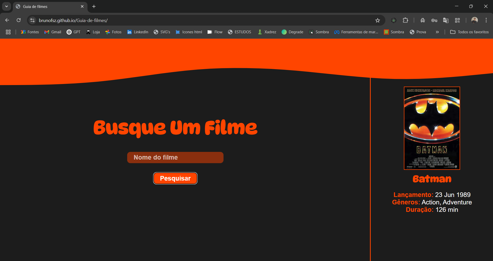

# Guia de Filmes 🎬

Este é um projeto simples de um **Guia de Filmes** desenvolvido com **HTML, CSS e JavaScript puro**, utilizando a API pública da **OMDb (Open Movie Database)**. O objetivo é permitir que o usuário busque por qualquer filme e visualize informações como pôster, título, lançamento, gênero e duração.

## 🔍 Funcionalidades

- Campo de busca para filmes
- Requisição à API da OMDb com Axios
- Exibição dinâmica dos dados do filme:
  - Pôster
  - Título
  - Lançamento
  - Gêneros
  - Duração
- Mensagens de erro para filmes não encontrados
- Layout responsivo e estilizado

## 🧠 Tecnologias utilizadas

- HTML5
- CSS3
- JavaScript (Vanilla JS)
- Axios
- OMDb API (https://www.omdbapi.com/)

## 💻 Como usar

- Abra o link `"https://brunofsz.github.io/Guia-de-filmes/"` no seu navegador

     OU

1. Clone o repositório
2. Abra o arquivo `index.html` no seu navegador

> **Nota:** Certifique-se de estar conectado à internet, pois o projeto utiliza a API OMDb e o CDN do Axios.

## 📸 Preview

